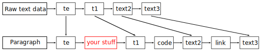

<!--
	SPDX-FileCopyrightText: 2022-2025 Igor Mironchik <igor.mironchik@gmail.com>
	SPDX-License-Identifier: MIT
-->


`md4qt` is a header-only C++ library for parsing Markdown.

`md4qt` supports CommonMark 0.31.2 Spec, and some GitHub extensions, such as
tables, footnotes, tasks lists, strikethroughs, LaTeX Maths injections, GitHub's auto-links.

`md4qt` can be built with Qt6 or you can implement your own custom traits for other libraries.

This library parses Markdown into tree structure.

* [Example](#example)
* [License](#license)
* [Benchmark](#benchmark)
* [Playground](#playground)
* [Release notes](#release-notes)
* [Known issues](#known-issues)
* [Why another AST Markdown parser?](#why-another-ast-markdown-parser)
* [What should I know about links in the document?](#what-should-i-know-about-links-in-the-document)
* [What is the second argument of `MD::Parser::parse()`?](#what-is-the-second-argument-of-mdparserparse)
* [What is an `MD::Anchor`?](#what-is-an-mdanchor)
* [Does the library throw exceptions?](#does-the-library-throw-exceptions)
* [Why `MD::Parser` and `MD::Document` are templates?](#why-mdparser-and-mddocument-are-templates)
* [So, how can I use `md4qt` with `Qt6`?](#so-how-can-i-use-md4qt-with-qt6)
* [Why is parsing wrong on Windows with `std::ifstream`?](#why-is-parsing-wrong-on-windows-with-stdifstream)
* [How can I convert `MD::Document` into `HTML`?](#how-can-i-convert-mddocument-into-html)
* [How can I obtain positions of blocks/elements in `Markdown` file?](#how-can-i-obtain-positions-of-blockselements-in-markdown-file)
* [How can I easily traverse through the `MD::Document`?](#how-can-i-easily-traverse-through-the-mddocument)
* [Is it possible to write custom text plugin for this parser?](#is-it-possible-to-write-custom-text-plugin-for-this-parser)
* [What is a `ID` of a plugin?](#what-is-a-id-of-a-plugin)
* [What is a `MD::TextPluginFunc<Trait>`?](#what-is-a-mdtextpluginfunctrait)
* [What is `processInLinks` flag for?](#what-is-processinlinks-flag-for)
* [What for is a `userData` argument?](#what-for-is-a-userdata-argument)
* [Could you show an example of a plugin?](#could-you-show-an-example-of-a-plugin)
* [I didn't understand how raw text data correlates with a paragraph.](#i-didnt-understand-how-raw-text-data-correlates-with-a-paragraph)
* [How can I get a string of `MD::StyleDelim`?](#how-can-i-get-a-string-of-mdstyledelim)
* [Is it possible to find `Markdown` item by its position?](#is-it-possible-to-find-markdown-item-by-its-position)
* [How can I walk through the document and find all items of given type?](#how-can-i-walk-through-the-document-and-find-all-items-of-given-type)
* [How can I add and process a custom (user-defined) item in `MD::Document`?](#how-can-i-add-and-process-a-custom-user-defined-item-in-mddocument)
* [Why writing plugin for new emphasis is not so trivial?](#why-writing-plugin-for-new-emphasis-is-not-so-trivial)
* [You have API for text plugins, but where is for blocks?](#you-have-api-for-text-plugins-but-where-is-for-blocks)

# Example

```cpp
#define MD4QT_QT_SUPPORT
#include <md4qt/parser.hpp>

int main()
{
    MD::Parser<MD::QStringTrait> p;

    auto doc = p.parse(QStringLiteral("your_markdown.md"));

    for (auto it = doc->items().cbegin(), last = doc->items().cend(); it != last; ++it) {
        switch ((*it)->type())
        {
        case MD::ItemType::Anchor :
        {
            auto a = static_cast<MD::Anchor<MD::QStringTrait>*> (it->get());
            qDebug() << a->label();
        }
            break;

        default :
            break;
        }
    }

    return 0;
}
```

# License

```cpp
/*
    SPDX-FileCopyrightText: 2022-2025 Igor Mironchik <igor.mironchik@gmail.com>
    SPDX-License-Identifier: MIT
*/
```

# Benchmark

Approximate benchmark with [cmark-gfm](https://github.com/github/cmark-gfm) says,
that Qt6 version of `md4qt` is slower ~10 times.
But you will get complete C++ tree structure of the Markdown document with all
major extensions and sugar and cherry on the cake.

| Markdown library | Result |
| --- | --- |
| [cmark-gfm](https://github.com/github/cmark-gfm) | ~0.2 ms |
| `md4qt` with `Qt6` | ~2.2 ms |
| `md4qt` with `Qt6` without `GitHub` auto-links extension | ~1.9 ms |

Initially parser was done by splitting text into blocks and these blocks go for
processing. I did it so and for performance reason this is a mistake, as canonical
Markdown parser should get character by character from the input string, next by next
with making a decision what it can be and doing a parsing. With canonical approach
performance can be a division by two of `md4qt` result, as a minimum. Ok, mistake is done,
a lot of things is done... But API of `md4qt` I find a user-friendly, with exception of
text plugins writing, there a developer can find a process a little complicated.
Who knows... I guess for desktop applications performance of `md4qt` is enough,
you can look at [Playground](#playground) and
[Why another AST Markdown parser?](#why-another-ast-markdown-parser)
sections for more information.

# Playground

You can play in action with `md4qt` in [Markdown Tools](https://github.com/igormironchik/markdown-tools). There you can find `Markdown` editor/viewer/converter to `PDF`.

And [KleverNotes](https://invent.kde.org/office/klevernotes) from `KDE` uses `md4qt` too.

# Release notes

* Note that version **4.0.0** is API incompatible with **3.0.0**. In version **4.0.0** were
changed rules with spaces, this version fully supports CommonMark standard in this question.
Methods `isSpaceBefore()`, `isSpaceAfter()` were removed, and spaces are presented as in
Markdown, so keep it in mind.

# Known issues

You can find a list of know issues [here](./known_issues.md). These issues are controversial
a little, so at this time they exists as is in `md4qt`. But if you'd like to see any of them
resolved, welcome to discussion.

# Why another AST Markdown parser?

 * When I wrote this library I knew about `md4c` parser, but not about `cmark-gfm`.
 `md4c` was not suitable for my purposes, whereas `cmark-gfm` could do
 everything I needed. But God did it so, so I wrote `md4qt` and only later
 knew about `cmark-gfm`. Ok, code is written and tested. Let it be.

   What I can say yet, is that this library is C++. And for some people can be
   easier to use C++ code instead of C with freeing memory by hand. Qt do things
   easier by handling text encoding... So let it be, guys.

   And one more cherry on the cake - `md4qt` can parse Markdown recursively.
   What it is described below.

   If you need simple converter into `HTML`, possibly you will find other libraries are
   better for you. But if you need to do Markdown syntax highlighting, some complex things
   during editing of Markdown, like checking for Markdown element by its position, some
   clever things... Possibly you will find API of `md4qt` much more better. Guys, use
   what you like, but don't cry if something can not be done in a library you used :)
   I don't want to say that everything is possible in `md4qt`, but this library is 
   supported. For better support, please, write direct email to
   igor.mironchik@gmail.com, issues on https://invent.kde.org can be missed by me for a long time,
   as https://invent.kde.org don't send notifications to me... Sorry :(

# What should I know about links in the document?

 * In some cases in Markdown link's URL is something document related. So, when
you got a `MD::Link` in the document check if the labelled links of the
document contains key with URL in the link, and if so, use URL from
labelled links, look:

   ```cpp
   MD::Link<MD::QStringTrait> *item = ...;

   QString url = item->url();

   const auto it = doc->labeledLinks().find(url);
   
   if (it != doc->labeledLinks().cend()) {
       url = it->second->url();
   }
   ```

# What is the second argument of `MD::Parser::parse()`?

 * Second argument of `MD::Parser::parse()` is a flag that tells the
parser to process Markdown files recursively or not. If parsing is recursive
then if in the targeted Markdown file exist links to other Markdown files,
then they will be parsed too and will exist in the resulting document.

# What is an `MD::Anchor`?

 * As `md4qt` supports recursive Markdown parsing, then in the resulting
document can be represented more than one Markdown file. Each file in the
document starts with `MD::Anchor`, it just shows that during traversing through
the document you reached new file.

# Does the library throw exceptions?

 * No. This library doesn't use exceptions. Any text is a valid Markdown, so I
don't need to inform user about errors. Qt itself doesn't use exceptions either.
So you can catch only standard C++ exceptions, like `std::bad_alloc`, for
example.

# Why `MD::Parser` and `MD::Document` are templates?

 * Since version `2.0.0` `md4qt` can be built not only with `Qt6`, but with
`STL` too. The code of the parser is the same in both cases. I just added two
ready traits to support different C++ worlds. With `STL` I use `ICU` library
for Unicode handling, and `uriparser` library to parse and check URLs.
These dependencies can be installed with the Conan package manager.

   Since version `4.2.0` `ICU` support was dropped. This version uses string views,
   that `ICU` doesn't support.

# So, how can I use `md4qt` with `Qt6`?

 * To build with `Qt6` support you need to define `MD4QT_QT_SUPPORT`.
   In this case you will get access to `MD::QStringTrait` to work with
   Qt's classes and functions. In this case in dependencies you will
   receive `Qt6`.

# Why is parsing wrong on Windows with `std::ifstream`?

 * Such a problem can occur on Windows with MSVC if you open the file in text
mode, so for `MD::Parser` always open `std::ifstream` with `std::ios::binary`
flag. And yes, I expect to receive UTF-8 encoded content...

# How can I convert `MD::Document` into `HTML`?

 * In version `2.0.5` were made commits with implementation of
`MD::toHtml()` function. You can do the following:

   ```cpp
   #define MD4QT_QT_SUPPORT
   #include <md4qt/traits.h>
   #include <md4qt/parser.h>
   #include <md4qt/html.h>

   int main()
   {
       MD::Parser<MD::QStringTrait> p;

       auto doc = p.parse(QStringLiteral("your_markdown.md"));

       const auto html = MD::toHtml(doc);

       return 0;
   }
   ```

# How can I obtain positions of blocks/elements in `Markdown` file?

 * Done in version `2.0.5`. Remember that all positions in `md4qt` start with 0,
where first symbol on first line will have coordinates `(0,0)`. One more important thing is
that all ranges of position in `md4qt` are given inclusive, that mean that last column
of any element will point to the last symbol in this element.

# How can I easily traverse through the `MD::Document`?

* Since version `2.6.0` in `visitor.h` header implemented `MD::Visitor` interface
with which you can easily walk through the document, all you need is implement/override
virtual methods to handle that or another element in the document, like:

  ```cpp
  /*!
   * Handle heading.
   *
   * \a h Heading.
   */
  virtual void onHeading(Heading<Trait> *h) = 0;
  ```

# Is it possible to write custom text plugin for this parser?

* Since version `3.0.0` in the `MD::Parser` was added a method for adding custom
text plugins.

  ```cpp
  /*!
   * Add text plugin.
   *
   * \a id ID of a plugin. Use TextPlugin::UserDefinedPluginID value for start ID.
   *
   * \a plugin Function of a plugin, that will be invoked to processs raw text.
   *
   * \a processInLinks Should this plugin be used in parsing of internals of links?
   *
   * \a userData User data that will be passed to plugin function.
   */
  void
  addTextPlugin(int id,
                TextPluginFunc<Trait> plugin,
                bool processInLinks,
                const typename Trait::StringList &userData);
  ```

# What is a `ID` of a plugin?

* `ID` of a plugin is a regular `int` that should be (but not mandatory) started from

  ```cpp
  /*!
   * \enum MD::TextPlugin
   * \inmodule md4qt
   * \inheaderfile md4qt/parser.h
   *
   * \brief ID of text plugin.
   *
   * \value UnknownPluginID Unknown plugin.
   * \value GitHubAutoLinkPluginID GitHub's autolinks plugin.
   * \value UserDefinedPluginID First user defined plugin ID.
   */
  enum TextPlugin : int {
      UnknownPluginID = 0,
      GitHubAutoLinkPluginID = 1,
      UserDefinedPluginID = 255
  }; // enum TextPlugin
  ```

  `MD::UserDefinedPluginID` value. Note that plugins will be invoked corresponding
  to its `ID` from smallest to largest, so a developer can handle an order of text
  plugins.

# What is a `MD::TextPluginFunc<Trait>`?

* Text plugin is a usual function with a signature

  ```cpp
  /*!
   * \typealias MD::TextPluginFunc
   * \inmodule md4qt
   * \inheaderfile md4qt/parser.h
   *
   * \brief Functor type for text plugin.
   */
  template<class Trait>
  using TextPluginFunc = std::function<void(std::shared_ptr<Paragraph<Trait>>,
                                            TextParsingOpts<Trait> &,
                                            const typename Trait::StringList &)>;
  ```

  You will get already parsed `MD::Paragraph` with all items in it. And you are
  able to process remaining raw text data and check it for what you need.

  `MD::TextParsingOpts` is an auxiliary structure with some data. You are interested
  in `bool collectRefLinks;`, when this flag is `true` the parser is in a state of
  collecting reference links, and on this stage plugin may do nothing.

  A last argument of plugin function is a user data, that was passed to 
  `MD::Parser::addTextPlugin()` method.

  A most important thing in `MD::TextParsingOpts` structure is a
  `std::vector<TextData> m_rawTextData;`. This vector contains not processed raw
  text data from `Markdown`. The size of `m_rawTextData` is the same as a count of
  `MD::Text` items in `MD::Paragraph`, and theirs sizes should remain equal. So, if you replace
  one of text item with something, for example link, corresponding text item
  should be removed from `MD::Paragraph` and `m_rawTextData`. Or if you replace just
  a part of text item - it should be modified in `MD::Paragraph` and `m_rawTextData`.
  Be careful, it's UB, if you will make a mistake here, possibly you will crash.

  One more thing - don't forget to set positions of elements in `MD::Document` to new
  values if you change something, and don't forget about such things like
  `MD::ItemWithOpts::openStyles()` and `MD::ItemWithOpts::closeStyles()`. Document should
  remain correct after your manipulations, so any syntax highlighter, for example,
  won't do a mistake.

  Note, that `MD::TextData` is

  ```cpp
  /*!
   * \class MD::TextParsingOpts::TextData
   * \inmodule md4qt
   * \inheaderfile md4qt/parser.h
   *
   * \brief Raw text data.
   *
   * Raw text data for corresponding text item in paragraph. Here text is not pre-processed
   * with anything.
   */
  struct TextData {
      /*!
       * String.
       */
      typename Trait::String m_str;
      /*!
       * Local start position of string.
       */
      long long int m_pos = -1;
      /*!
       * Local line number.
       */
      long long int m_line = -1;
  };
  ```

  And `m_pos` and `m_line` here is relative to `MD::MdBlock<Trait> & fr;` member of
  `MD::TextParsingOpts`, but document require absolute positions in the `Markdown`
  text. So when you will set positions to new items, use, for example, a following
  code.

  ```cpp
  setEndColumn(po.fr.data.at(s.line).first.virginPos(s.pos));
  ```

  where `s` is an object of `MD::TextData` type.

# What is `processInLinks` flag for?

* `processInLinks` flag should be set to false if you desire to not process your
plugin in link's captions, as, for example, links can't contain other links, so
if you are implementing a plugin for new links this flag should be set to `false`
for your plugin.

# What for is a `userData` argument?

* This list of strings will be passed to plugin function. This is auxiliary data
that can be handy for plugin implementation.

# Could you show an example of a plugin?

* In `md4qt` already exists one text plugin for handling GitHub's auto-link. A
  plugin function is quite simple, look.

  ```cpp
  /*!
   * \inheaderfile md4qt/parser.h
   *
   * GitHub autolinks plugin.
   *
   * \a p Paragraph.
   *
   * \a po Text parsing options.
   */
  template<class Trait>
  inline void
  githubAutolinkPlugin(std::shared_ptr<Paragraph<Trait>> p,
                       TextParsingOpts<Trait> &po,
                       const typename Trait::StringList &)
  {
      if (!po.m_collectRefLinks) {
          long long int i = 0;

          while (i >= 0 && i < (long long int)po.m_rawTextData.size()) {
              i = processGitHubAutolinkExtension(p, po, i);

              ++i;
          }
      }
  }
  ```

  But `MD::processGitHubAutolinkExtension()` is not so trivial :) Have a look
  at its implementation to have a good example, it's placed in `parser.h`.

  Good luck with plugining. :)

# I didn't understand how raw text data correlates with a paragraph.

* Let I will show you on example how raw text data correlate with paragraph. Just two
  diagrams and you won't have any more questions. Look.

  Consider we want to replace any occurrence of `@X` by some kind of a link. Before
  modifications we had.

  

  And after work of your plugin we should have.

  

# How can I get a string of `MD::StyleDelim`?

* Since version `3.0.0` was added a function to get a substring from text fragment with given
virgin positions.

  ```cpp
  /*!
   * \inheaderfile md4qt/parser.h
   *
   * Returns substring from fragment with given virgin positions.
   *
   * \a fr Text fragment (list of lines).
   *
   * \a virginPos Virgin coordinates of text in fragment.
   */
  template<class Trait>
  inline typename Trait::String
  virginSubstr(const MdBlock<Trait> &fr, const WithPosition &virginPos);
  ```

  And a function to get local position from virgin one.

  ```cpp
  /*!
   * \inheaderfile md4qt/parser.h
   *
   * Returns local position ( { column, line } ) in fragment for given virgin position if exists.
   * Returns { -1, -1 } if there is no given position.
   *
   * \a fr Text fragment (list of lines).
   *
   * \a virginColumn Virgin position of character.
   *
   * \a virginLine Virgin line number.
   */
  template<class Trait>
  inline std::pair<long long int, long long int>
  localPosFromVirgin(const MdBlock<Trait> &fr, long long int virginColumn, long long int virginLine);
  ```

# Is it possible to find `Markdown` item by its position?

 * Since version `3.0.0` was added new structure `MD::PosCache`. You can pass
`MD::Document` into its `MD::PosCache::initialize()` method and find first item with all its
nested first children by given position with `MD::PosCache::findFirstInCache()` method.

# How can I walk through the document and find all items of given type?

 * Since version `3.0.0` was added algorithm `MD::forEach()`.

   ```cpp
   /*!
    * \inheaderfile md4qt/algo.h
    *
    * \brief Calls function for each item in the document with the given type.
    *
    * \a types Vector of item's types to be processed.
    *
    * \a doc Document.
    *
    * \a func Functor object.
    *
    * \a maxNestingLevel Maximun nesting level. 0 means infinity, 1 - only top level items...
    */
   template<class Trait>
   inline void forEach(
       const typename Trait::template Vector<ItemType> &types,
       std::shared_ptr<Document<Trait>> doc,
       ItemFunctor<Trait> func,
       unsigned int maxNestingLevel = 0);
   ```

# How can I add and process a custom (user-defined) item in `MD::Document`?

 * Since version `3.0.0` in `MD::ItemType` enum appeared `MD::UserDefined` enumerator.
So you can inherit from any `MD::Item` class and return from `type()` method
value greater or equal `MD::ItemType::UserData`. To handle user-defined types of
items in `MD::Visitor` class now exists method `void onUserDefined(MD::Item<Trait> *item)`.
So you can handle your custom items and do what you need.

# Why writing plugin for new emphasis is not so trivial?

 * This task is not very trivial, this is true. But it's not so hard, a developer just need
to be a little attentive. But I decided to simplify you the life a little, and in
version `4.3.0` has appeared new include file `md4qt/plugins.h` where is implemented a function.

   ```cpp
   template<class Trait>
   inline void emphasisTemplatePlugin(std::shared_ptr<Paragraph<Trait>> p,
                                      TextParsingOpts<Trait> &po,
                                      const typename Trait::StringList &opts)
   ```

   Adding this function to `MD::Parser` allows to have new emphasises. Read the documentation
   for further details.

# You have API for text plugins, but where is for blocks?

 * Since version `4.4.0` in `md4qt` exists

   ```cpp
   template<class Trait>
   class BlockPlugin;
   ```

   class to create a block plugin. And in `MD::Parser` exist new methods to add and
   remove block plugins from parser. You can make block plugins since this version.
   An example of ready one block plugin you can see in `md4qt/plugins.h` header file,
   where is implemented `YAML` header plugin for Markdown.
